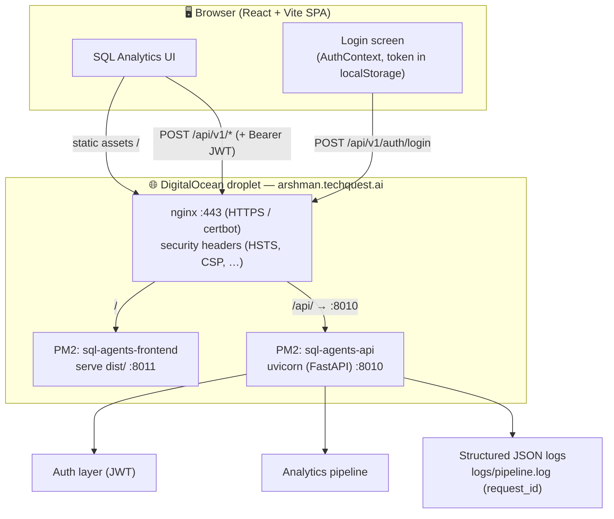
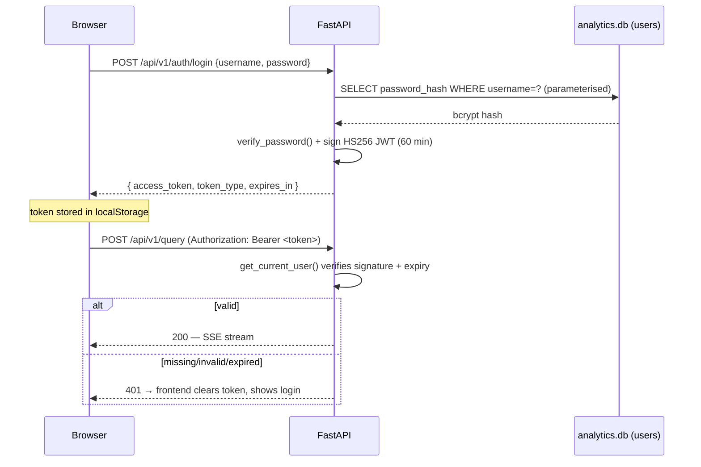
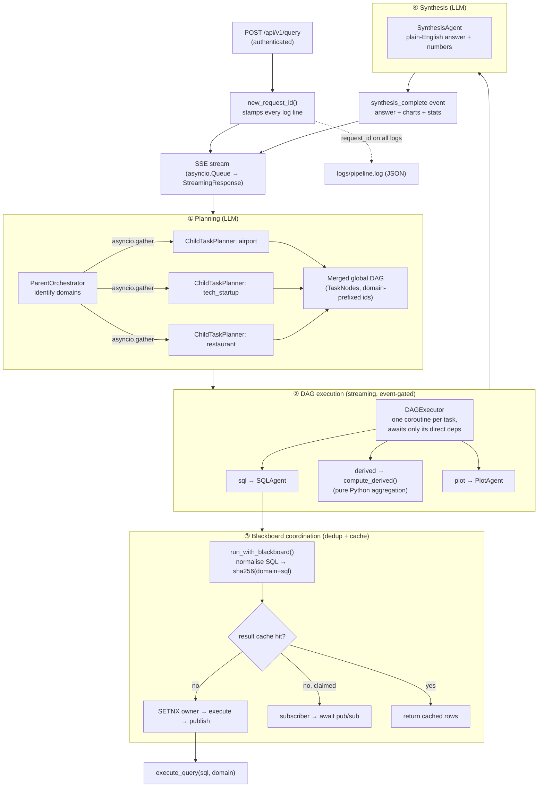
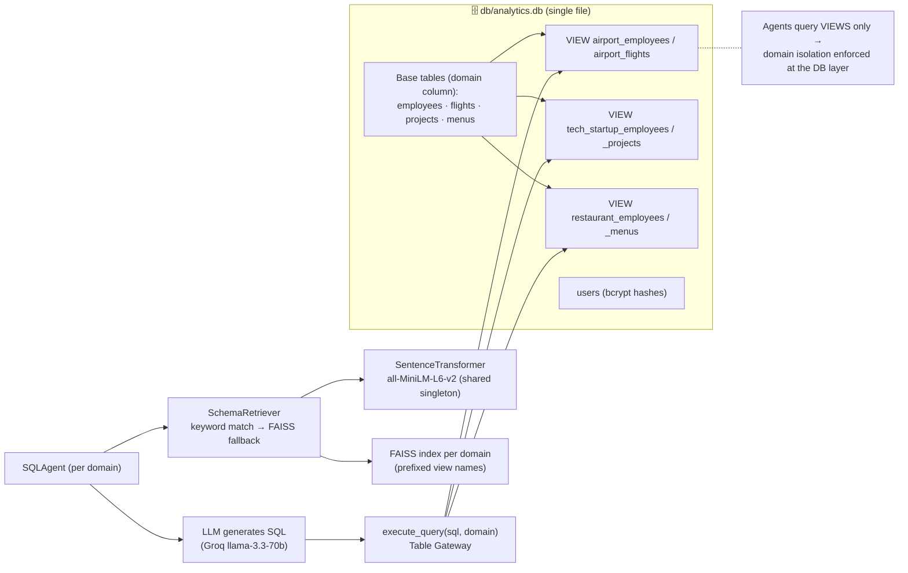
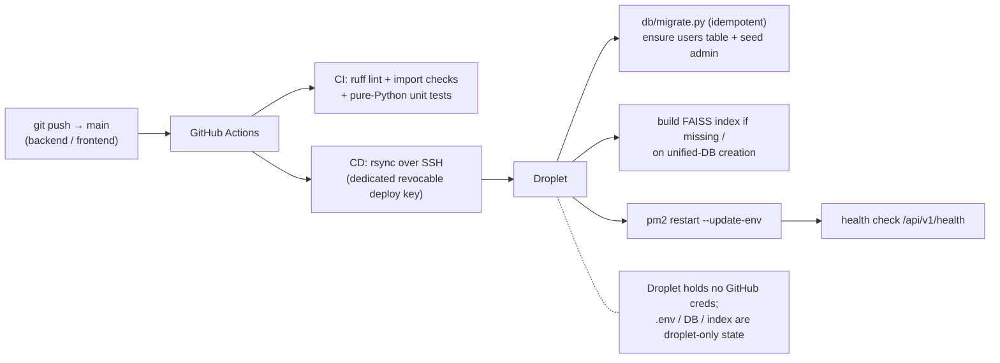

# Architecture Flow Diagram

Up-to-date end-to-end architecture of the Multi-Agent SQL Analytics system,
reflecting the current state: unified database, JWT auth, and correlated
structured logging.

The Mermaid blocks below render natively on GitHub (and in VS Code with the
Mermaid extension). Pre-rendered **PNG exports** are in
[`docs/diagrams/`](./diagrams/) for sharing without GitHub — see
[Rendered exports](#rendered-exports-png) at the bottom. To edit, paste any
block into <https://mermaid.live> or import this file into Eraser/draw.io.

---

## 1. System overview (request lifecycle)

---

## 2. Authentication (JWT)

Public endpoints: `GET /health`, `POST /auth/login`.
Protected (require Bearer token): `POST /query`, `POST /compare`, `POST /build-index`, `GET /auth/me`.

---

## 3. The four-phase analytics pipeline

---

## 4. Schema retrieval & the unified database

---

## 5. Deployment & CI/CD

---

## Key design properties

| Concern | How it's handled |
|---|---|
| **DB access pattern** | Table Gateway (`db/pool.py`) — one `execute_query(sql, domain)` routes to `analytics.db`; raw SQL, no ORM. |
| **Domain isolation** | Per-domain SQL **views** in one file; agents query views, so a domain agent cannot read another domain's rows. |
| **Auth** | JWT (HS256), bcrypt-hashed users table; protected routes via `Depends(get_current_user)`. |
| **Dedup / caching** | Blackboard: `sha256(domain+canonical_sql)`, SETNX ownership, pub/sub, TTL heartbeat. |
| **Schema context** | FAISS semantic retrieval returns only relevant tables → fewer tokens, fewer hallucinations. |
| **Observability** | Correlated `request_id` on every log line (ContextVar) + JSON rotating file. |
| **Streaming** | SSE via `asyncio.Queue` → `StreamingResponse`; client-disconnect cancels the pipeline task. |
| **CI/CD** | Push-based GitHub Actions; lint+import CI; rsync deploy with idempotent migrations + health gate. |

---

## Rendered exports (PNG)

Pre-rendered images of the diagrams above (generated with mermaid-cli):

1. [System overview](./diagrams/01-system-overview.png)
2. [Authentication (JWT)](./diagrams/02-authentication.png)
3. [Four-phase pipeline](./diagrams/03-pipeline.png)
4. [Schema retrieval & unified database](./diagrams/04-schema-and-database.png)
5. [Deployment & CI/CD](./diagrams/05-deployment-cicd.png)
